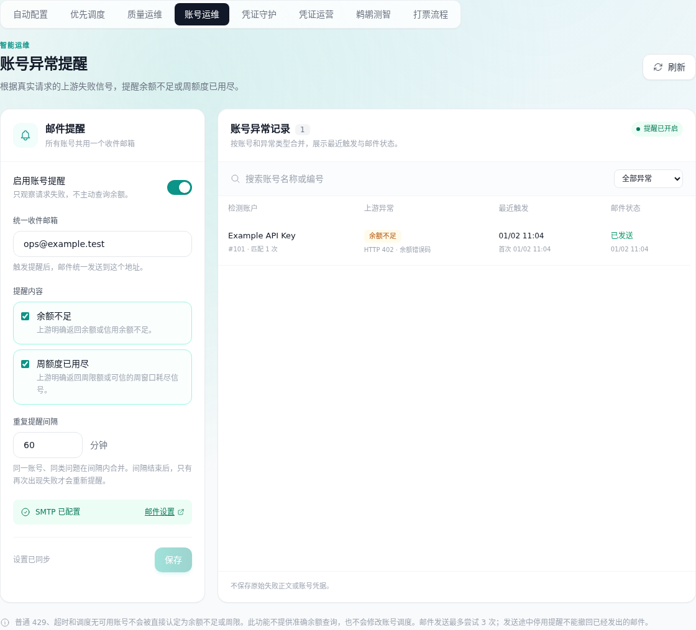
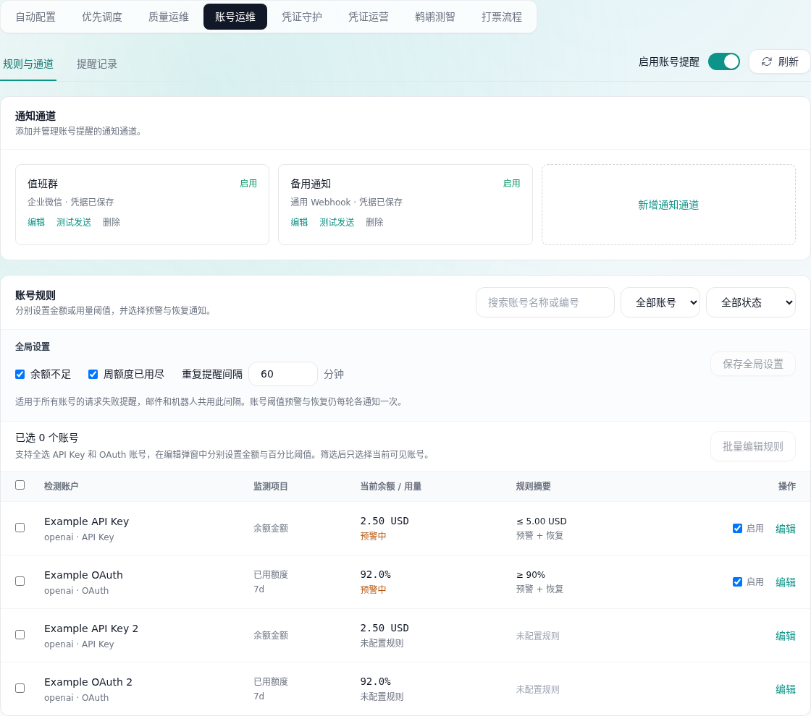
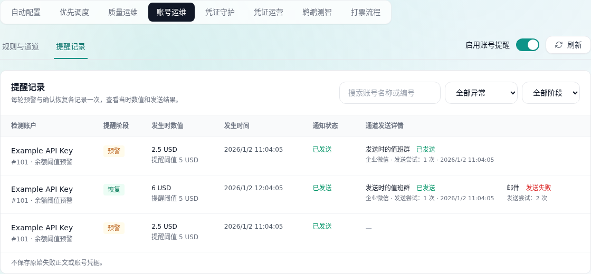
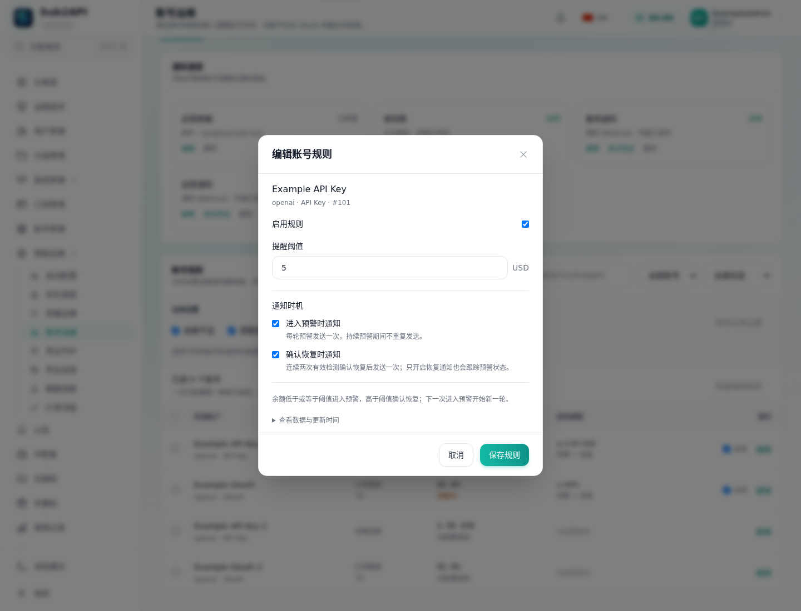
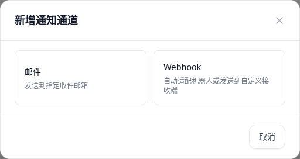
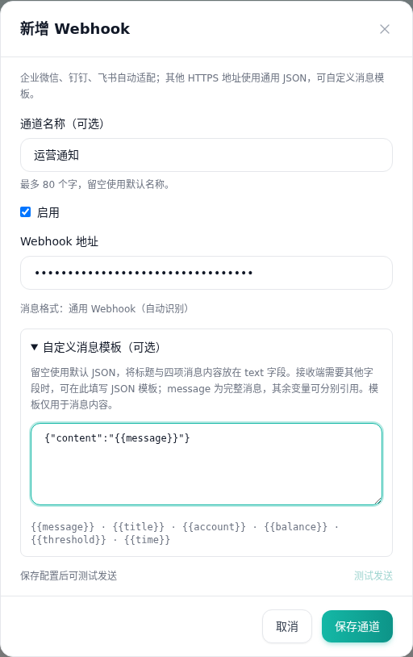
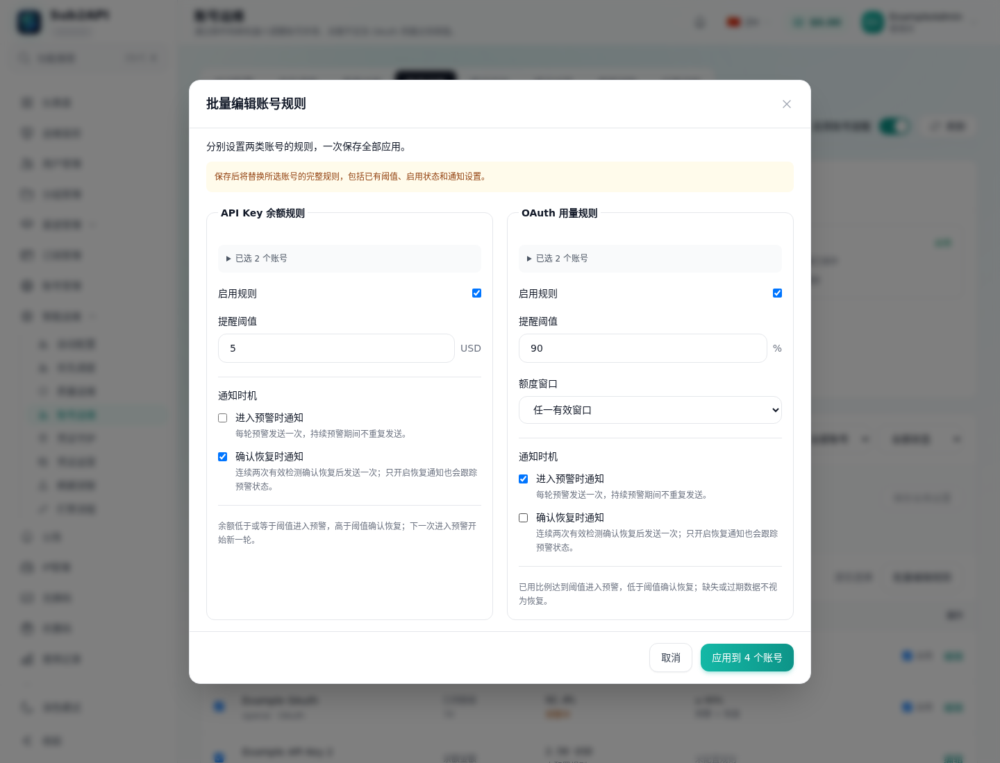
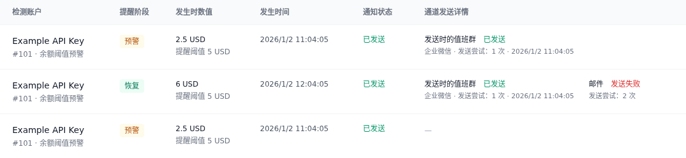

# 账号运维：通知通道与账号阈值

入口是「智能运维 → 账号运维」，页面内包含两个页签：默认打开左侧「规则与通道」，集中配置通知与账号规则；右侧「提醒记录」查看历史和发送结果。邮件通知继续使用现有 SMTP 配置；可添加 Webhook 通道，自动识别企业微信、钉钉、飞书，也支持其他公网 HTTPS 接收端。默认没有机器人或账号阈值，保存配置后才会生效。

## 配置通知

1. 点击「新增通知通道」，选择「邮件」或「Webhook」。选择邮件后填写收件邮箱，选择 Webhook 后填写地址；保存后才显示通道卡片。邮件通道不预先显示，已有邮箱可继续编辑或删除。邮件与 Webhook 均可填写自定义通道名称（最多 80 字），留空使用默认名称，已有通道可通过「编辑」改名。配置完成后开启通知总开关。
2. 新增 Webhook 时粘贴接收地址，无需选择平台。钉钉或飞书开启签名校验时同时填写签名密钥。机器人有关键词规则时可设置为 `Sub2API`。
3. 保存后可点击「测试发送」。测试会向保存的机器人发送测试消息，遵循和告警相同的发送速率限制，不创建账号异常记录。

Webhook 地址及签名密钥加密保存，读取配置时只返回是否已保存。再次编辑可留空保留，也可更新；更换地址后不会沿用旧签名密钥，如需签名请重新填写。签名密钥可明确清除。

最多配置 5 个 Webhook 通道。各通道单独记录发送结果和发送时的通道名称，已成功发送的历史记录不会随改名重写；单纯改名不会重发通知。正常重试时跳过已成功通道，失败最多尝试 3 次。刷新按钮旁可直接切换「启用账号提醒」总开关，在两个页签中均可操作。邮件与机器人在各自编辑弹窗中保存，单个及批量账号阈值在居中弹窗中保存。账号规则上方的「全局设置」集中配置「余额不足」「周额度已用尽」及重复提醒间隔，重复间隔仅用于这类请求失败提醒；输入范围为 5～1440 分钟。总开关、邮件和全局规则分别保存对应字段，不覆盖其他区域的设置。操作成功和失败通过系统顶部浮动消息显示。

### 其他 Webhook 接收端

其他公网 HTTPS 地址默认收到以下 JSON，其中 `message` 会替换为标题及账号、余额、阈值、时间四项正文：

```json
{"text":"{{message}}"}
```

如果接收端要求不同字段，展开「自定义消息模板」填写 JSON 对象。例如，接收端要求 `content` 时填 `{"content":"{{message}}"}`；需要分别处理四项数据时可填：

```json
{
  "account": "{{account}}",
  "balance": "{{balance}}",
  "threshold": "{{threshold}}",
  "time": "{{time}}"
}
```

可用变量是 `message`、`title`、`account`、`balance`、`threshold`、`time`，只替换 JSON 字符串中的变量。变量值会安全编码，账号名称中的引号或换行不会破坏 JSON。余额与阈值是带单位的展示字符串。模板留空恢复默认，模板仅用于消息内容，不要填入凭据。

自定义接收端以 HTTP 2xx 判断接收成功；不解读其平台专用业务码。企业微信、钉钉和飞书继续检查各自的业务响应及签名。保存和发送均限制安全地址，不跟随重定向；不支持内网、环回或云元数据地址。不同平台的专用鉴权、签名协议仍可能需要转发服务，通用 JSON 不能保证每个平台直接兼容。

## 账号阈值

| 账号类型 | 设置内容 | 触发条件 | 示例 |
| --- | --- | --- | --- |
| API Key | 余额金额与该账号的单位 | 有效余额 ≤ 阈值 | USD 余额为 3.20，阈值为 5.00 |
| OAuth | 已用额度百分比与窗口 | 有效已用百分比 ≥ 阈值 | 7d 用量为 92%，阈值为 90% |

点击账号行的「编辑」，分别填写阈值并启用规则。弹窗内的「进入预警时通知」「确认恢复时通知」独立控制，新规则默认均开启；两者都关闭时只记录状态变化。OAuth 可选具体窗口或「任一有效窗口」；后一种会检查当前有效窗口中最高的已用比例。未配置的账号不会产生阈值提醒。金额阈值不能配置给 OAuth，百分比阈值不能配置给 API Key。

勾选多个账号后，可点击「批量编辑规则」。表头支持全选当前可见的 API Key 与 OAuth 账号；混合选择时，居中弹窗分为「API Key 余额规则」和「OAuth 用量规则」，分别填写金额或百分比阈值、启用状态及通知时机。API Key 账号需使用相同的当前单位；OAuth 可使用「任一有效窗口」或所选 OAuth 账号共有的窗口。保存会一次提交两类规则并覆盖选中账号的原规则；任一账号校验或保存失败时，整个批次全部保持原状。改变类型筛选会清空选择，搜索和状态筛选会移除隐藏账号的选择。

金额使用「上游渠道声明」已有的余额快照，不执行汇率换算。New API 余额是标准化 USD。需要保持现有余额探测或采样更新；查询失败、未探测、无限额度、过期数据及不一致的单位不会被当作零余额。

OAuth 使用现有进度条的数据：OpenAI/Anthropic 的已有采样、Grok 保存的账单数据、Anthropic/Antigravity 的成功缓存，以及 Gemini 的本地额度统计。没有可用来源时会显示状态。此功能不会为了通知额外调用 OpenAI 模型接口；使用已有窗口信息，样本有效期最多 15 分钟，并检查窗口重置时间。

页面展示数据更新时间和窗口重置时间。每轮进入预警只创建一次预警记录，持续预警不会按间隔重发。连续两次有效检测（至少间隔 15 秒）确认恢复后创建一次恢复记录；恢复后再次进入预警立即开始下一轮。仅启用恢复通知也会跟踪预警。数据缺失、过期或失败会中断恢复确认，不会伪造恢复。

每轮状态持久保存，服务重启或多个实例并发检测不会重复创建同一轮业务通知。发送前会检查规则、账号和预警资格。恢复消息展示恢复发生时的数据；后续再进入预警不会改写之前的恢复记录。修改阈值、凭据或账号类型会重新建立基线，不会被当作余额恢复。通知记录保留每次预警、恢复及通道发送结果。通知状态右侧的「通道发送详情」列直接展示每个通道的名称、状态、发送次数和时间，无需点击展开。多个通道横向排列，窄屏可横向滚动表格。

如果余额单位变化，列表仍显示已保存规则的币种；编辑弹窗需要明确切换单位并重新填写金额，避免自动换算或误改阈值。

## 消息示例

Webhook 正文仅包含账户、余额、阈值、时间四项；标题区分余额不足和余额恢复：

```text
Sub2API · 上游账户余额不足
账户：ExampleKey (#18)
余额：$2.973
阈值：$3
时间：2026-10-07 13:05:26
```

```text
Sub2API · 上游账户余额已恢复
账户：ExampleKey (#18)
余额：$11.053
阈值：$3
时间：2026-10-07 22:11:56
```

USD 金额使用 `$`，其他单位按原单位显示。OAuth 的余额显示剩余百分比与额度窗口；例如已用 92% 时显示 `8%（7d）`，已用阈值 90% 显示 `10%（已用 90%）`。只调整展示口径，监测规则仍按配置的已用百分比判断。

时间使用事件发生时间与服务器配置的时区，精确到秒。基于请求失败响应的提醒无法保证取得实际余额，缺少数值时显示「未获取」；这类提醒没有数值阈值，显示「不适用」。测试发送也使用四项字段，标题和账户明确标为测试。

邮件继续使用详细表格；企业微信和钉钉使用 Markdown，飞书使用卡片。标题保留 `Sub2API` 供机器人关键词规则匹配。内容不包含账号密钥、Webhook 凭据、用户提示词或原始上游错误正文。

## 部署与回退

需要固定的凭据加密密钥（现有 `totp.encryption_key` / `TOTP_ENCRYPTION_KEY`）；备份应保留数据库和固定密钥。迁移 `266_account_ops_notifications.sql` 增加提醒详情与通道结果；后续 `267_account_ops_threshold_episodes.sql` 增加持久周期状态与独立过渡记录。旧提醒记录保留，已发送的持续预警不重放；仍待发送或部分失败的旧提醒保留送达结果和剩余尝试次数，迁入对应周期。旧数据若保留了成功发送时间却已清空通道结果，无法区分持续预警与后续周期；迁移会保留历史并抑制这类旧待发记录，避免重复发送已经送达的提醒。

本次通用 Webhook 和批量规则使用已有设置结构，无新增数据库迁移。原有邮件及三个平台的机器人配置可继续读取。新增通用 Webhook 后，旧版本不识别 custom 通道，回退时应恢复相应通知配置备份。回退二进制不会撤销新增字段、设置或阈值记录；若需要完全恢复迁移前状态，使用对应数据库与二进制备份。通知总开关、机器人与阈值均由管理员配置。

机器人协议参考：[企业微信群机器人](https://developer.work.weixin.qq.com/document/path/91770)、[钉钉自定义机器人](https://open.dingtalk.com/document/robots/custom-robot-access)、[飞书自定义机器人](https://open.feishu.cn/document/client-docs/bot-v3/add-custom-bot)。

## 界面示例

以下图片由隔离浏览器和虚构 API 响应生成；所有账号、邮箱、余额和通知记录都是示例，未调用真实接收端。

| 原界面 | 规则与通道 |
| --- | --- |
|  |  |












