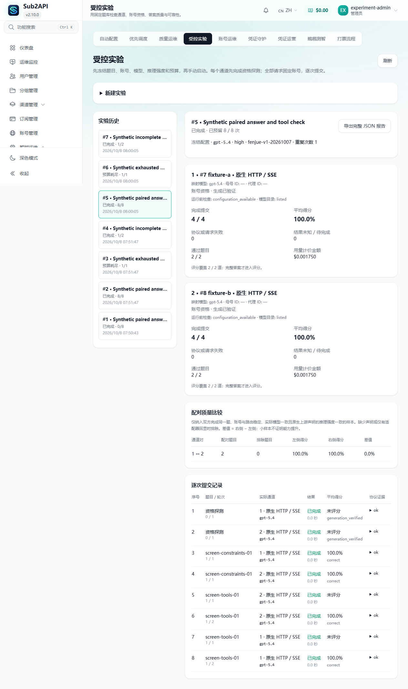

# 受控实验页面验收截图

`synthetic-paired-report.png` 来自隔离实例，使用虚构管理员、虚构账号和合成 Responses 上游。两个账号通过资格探测，完成一题约束推理和一题工具续轮，共预留八次提交；页面显示两个配对样本及逐次证据。

截图对应先前已验收的实现提交 `e454927400f9d3d937401e16f12ac43c6db6feb3`。本 PR 延续该页面及交互，并在最新 `production` 上重新验证页面测试、导航、语言键、类型检查和构建；后端另适配现有协议总开关与 Prism 用量不可用状态。截图尚未包含本 PR 后续增加的 WebSocket 配置提示和“该通道未执行”说明。截图中的 100% 来自合成上游，不能用于评估真实账号的模型质量。

改动前没有受控实验页面，因此没有同一页面的改动前截图。已有普通账号测试仍是单独入口。

交互步骤：完整管理员打开“智能运维 → 受控实验”，保存两条原生 HTTP 通道、两道题、一次重复、八次提交预算的草案；手动启动后选择完成的记录，查看资格、评分、配对和逐次提交明细。自动验收脚本 `scripts/verify-controlled-experiments.ps1` 仅接受 loopback 的合成测试实例。

